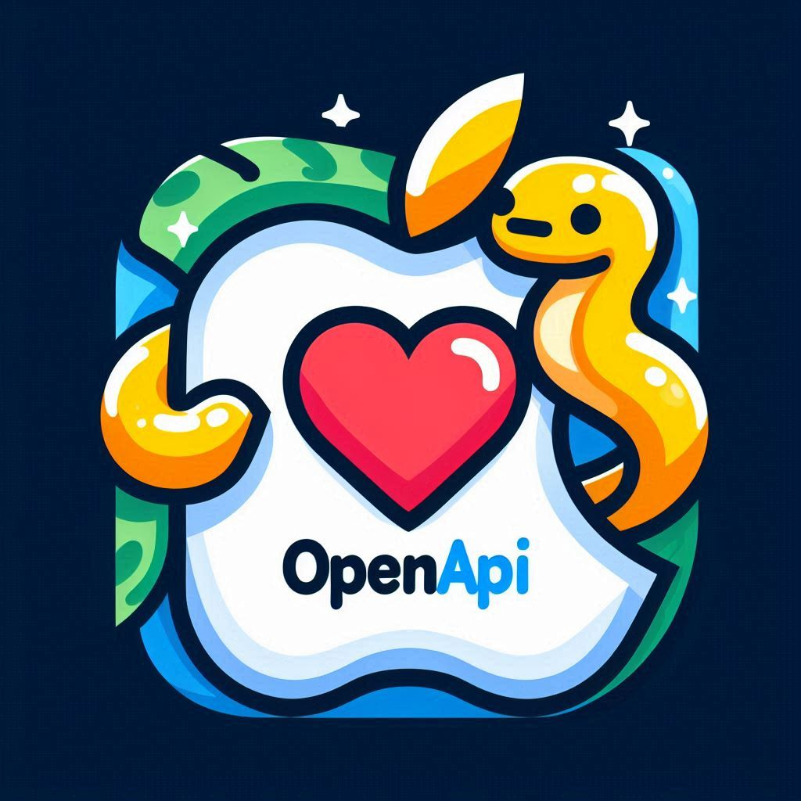

# Swift Code Generation Based on OpenAPI
{ width=128 height=128 }

## Steps to Generate Swift Code Using OpenAPI Description

1. **Update SPM Versions**
   - Ensure the Swift Package Manager (SPM) versions are up to date in `Package.swift`.

2. **Update OpenAPI Schema**
   - Update the `openapi.yaml` file with your OpenAPI schema description.

3. **Build the Project**
   - Navigate to the project folder and run:
     ```bash
     swift build
     ```
   - Note: You will encounter some errors because the handler in `GenServer.swift` does not manage the endpoints. This is acceptable as the code generator can still be used for the client and types.

4. **Generate Types**
   - Run the following command to generate types in the `Generated` folder:
     ```bash
     swift run swift-openapi-generator generate --mode types --output-directory Generated Sources/openapi.yaml
     ```

5. **Generate Client**
   - Run the following command to generate the client in the `Generated` folder:
     ```bash
     swift run swift-openapi-generator generate --mode client --output-directory Generated Sources/openapi.yaml
     ```

## Integrating with Your iOS Project

1. **Include Generated Files**
   - Include `Client.swift` and `Types.swift` in your iOS project.

2. **Add Required SPM Dependencies**
   - Add the following Swift Package Manager dependencies to your iOS project:
     - [swift-openapi-runtime](https://github.com/apple/swift-openapi-runtime)
     - [swift-openapi-urlsession](https://github.com/apple/swift-openapi-urlsession)

3. **Match SPM Versions**
   - Ensure that the SPM versions match the versions specified in `Package.swift` (see step 1).

4. **Use the Generated Code**
   - You can now use the generated code in your iOS project. Example:
     ```swift
     let client = Client(serverURL: Servers.server1(), transport: URLSessionTransport())
     let apiCall = try? await client.get_sol_api_sol_cities()
     switch apiCall {
       case .ok(let okResponse):
         let cities = try? okResponse.body.json
       case .internalServerError(let internalServerError):
         print("Error: \(internalServerError)")
       case .undocumented(let statusCode, let undocumentedPayload):
         print("Undocumented response: \(statusCode)")
       case .none:
         print("No response")
     }
     ```

## Optional: Create a Local Server

- If you want to create a local server, update `GenServer.swift` accordingly.